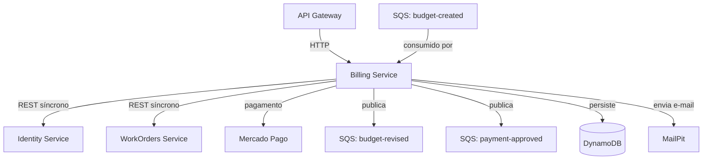

# Billing

Gestão de orçamentos e pagamentos.

[](http://34.231.107.126/dashboard?id=fiap-mechanics-billing)

## Definição do ambiente

- SDK: .NET 8.0
- Banco de dados: DynamoDB
- Serviço de E-mail: MailPit
- Chave pública para JWT: AWS Secrets Manager



## Serviços consumidos

- [Identity](https://github.com/FIAP-POS-TECH-13SOAT-MECHANICS/mechanics-identity): Informações de usuários.
- [WorkOrders](https://github.com/FIAP-POS-TECH-13SOAT-MECHANICS/mechanics-work-orders): Informações de clientes e
  veículos.

Para executar o projeto rodando as dependências pela AWS, suba os serviços e altere
as [configurações](https://github.com/FIAP-POS-TECH-13SOAT-MECHANICS/Mechanics-13soat/blob/main/docs/configuration.md)
com a URL do Load Balancer.
O comando abaixo retorna essa URL:

```powershell
aws elbv2 describe-load-balancers --names fiap-mechanics-dev --query "LoadBalancers[*].DNSName" --output text
```

## Messageria

As filas devem ser criadas pela camada `messaging`
do [repositório de infraestrutura](https://github.com/FIAP-POS-TECH-13SOAT-MECHANICS/mechanics-infra).

### Consumers

| Fila                             | Descrição                                                      |
|----------------------------------|----------------------------------------------------------------|
| `mechanics-{env}-budget-created` | Gera um snapshot do orçamento e solicita aprovação do usuário. |

### Publishers

| Fila                               | Descrição                                       |
|------------------------------------|-------------------------------------------------|
| `mechanics-{env}-budget-revised`   | Publica a decisão do cliente sobre o orçamento. |
| `mechanics-{env}-payment-approved` | Publica a confirmação de pagamento.             |

## Execução do projeto

Em cada nova fase do projeto, é recomendável apagar os volumes do Docker para evitar conflitos com a estrutura do banco
de dados criado em fases anteriores. Para fazer isso, execute o seguinte comando na raiz do projeto:

```bash
docker compose down -v
```

Primeiro crie uma cópia do arquivo de configurações do Docker:

```powershell
cp .env.example .env
```

Acesso o [Painel do Mercado Pago](https://www.mercadopago.com.br/developers/panel/app) para obter as credenciais da
conta. Informe as credenciais no arquivo `.env`.

Para execução local, crie também um
arquivo [appsettings.Development.json](https://github.com/FIAP-POS-TECH-13SOAT-MECHANICS/Mechanics-13soat/blob/main/docs/configuration.md)
com o seguinte conteúdo:

```json
{
    "MercadoPagoOptions": {
        "AccessToken": "<TOKEN_MERCADO_PAGO>",
        "NotificationUrl": "<URL_DE_PAGAMENTO>"
    },
    "CrossServiceClients": {
        "IdentityBaseUrl": "<URL_DO_SERVIÇO>",
        "ExecutionBaseUrl": "<URL_DO_SERVIÇO>"
    }
}
```

Antes do deploy, é necessário definir o valor do token no Secret Manager da AWS (ajuste de acordo o ambiente):

```powershell
aws secretsmanager put-secret-value --secret-id "fiap-mechanics-dev-payments/credentials" --secret-string '{"accessToken":"<TOKEN_MERCADO_PAGO>"}'
```

### Execução local (Debug)

Ao executar o projeto em ambientes de desenvolvimento, o token de autenticação **NÃO** é validado, portanto, pode-se
usar um token expirado ou mesmo gerar um com uma chave genérica, facilitando o desenvolvimento.

Primeiro inicie o banco de dados e serviço de e-mail:

```bash
docker compose up mailpit localstack -d
```

Com os recursos em execução, execute o projeto com o comando abaixo:

```bash
dotnet run --project ./src/Mechanics.Api/Mechanics.Api.csproj
```

Caso precise gerar um novo token, use o script `new-token.ps1`:

```powershell
.\scripts\new-token.ps1
```

### Docker Compose (Release)

Edite o arquivo `.env` com as URLs dos serviços a serem consumidos.
Para apontar para serviços, o mais fácil é executar o projeto em ambiente DEV na AWS e buscar a URL do Load Balancer.

```powershell
aws secretsmanager get-secret-value --secret-id "fiap-mechanics-dev-jwt/public-key" --query SecretString --output text > "src/Mechanics.Api/keys/jwt-public.pem"
```

Inicie o projeto via Docker Compose:

```bash
docker compose up -d --build
```

Após o processo concluir, o projeto estará disponível nas seguintes URLs:

- Swagger do projeto: <http://localhost:5000/billing/swagger>
- Cliente de e-mail: <http://localhost:8025>

Utilize o script `invoke-getToken.ps1` para obter um token de acesso. É necessário que o
serviço [Mechanics.Auth](https://github.com/FIAP-POS-TECH-13SOAT-MECHANICS/mechanics-auth) já esteja em execução.

### API Gateway

Ao acessar o projeto via API Gateway, é necessário obter um token de acesso.
Utilize o script `invoke-getToken.ps1` para obter um. É necessário que o
serviço [Mechanics.Auth](https://github.com/FIAP-POS-TECH-13SOAT-MECHANICS/mechanics-auth) já esteja em execução.

```powershell
.\scripts\invoke-getToken.ps1
```

Obtenha a URL do API Gateway com o seguinte comando:

```powershell
aws apigatewayv2 get-apis --query "Items[?Name=='fiap-mechanics-dev-api'].ApiEndpoint" --output text
```

## Pipeline de CI/CD

Ao criar uma PR para as branches abaixo, os testes automatizados serão executados.
Ao completar o PR, os testes são novamente executados e é feito o deploy no ambiente.

| Branch    | Ambiente    |
|-----------|-------------|
| `main`    | Production  |
| `release` | Staging     |
| `develop` | Development |

É necessário também informar o token do Mercado Pago nas secrets do projeto com o nome `TOKEN_MERCADO_PAGO`.

### SonarQube no CI

Este repositório usa workflow reutilizável do `mechanics-infra` para testes e análise SonarQube.

Configurações necessárias em `Settings > Secrets and variables > Actions`:

- Secret `SONAR_HOST_URL`
- Secret `SONAR_TOKEN`
- Variable `SONAR_PROJECT_KEY` (valor: `fiap-mechanics-work-orders`)

A análise é habilitada em:

- `pull_request` com destino em `main`;
- `workflow_dispatch` quando executado na branch `main`.

O SonarQube faz o coverage da camada de domínio e aplicação. Para isso, o workflow executa os testes com cobertura e publica os resultados usando o SonarScanner.
